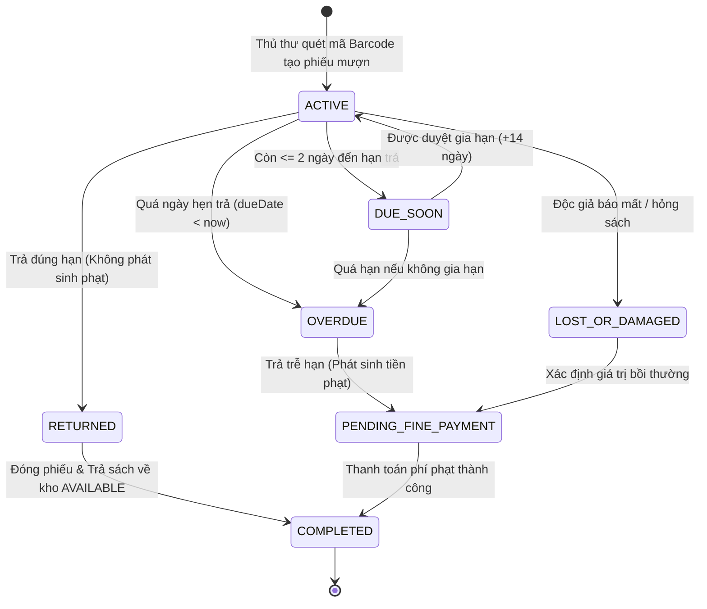
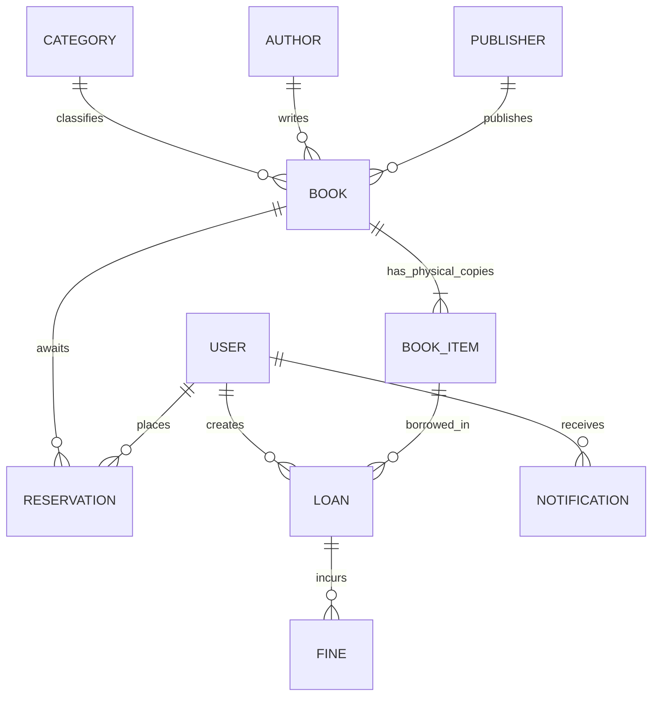

# 📚 Hệ Thống Quản Lý Thư Viện Số Thông Minh (Smart Library Management System)

<div align="center">


**Giải pháp chuyển đổi số toàn diện cho công tác quản lý học liệu và lưu thông sách học đường.**  
*Tích hợp Kiến trúc Máy trạng thái (State Machine), Tự động hóa tác vụ ngầm (Cronjob) và Phân quyền bảo mật đa lớp (RBAC).*

[🎯 Mục tiêu](#1--mục-tiêu-dự-án) • [🏗️ Kiến trúc & Công nghệ](#2-️-kiến-trúc--công-nghệ-tech-stack) • [⚡ Tính năng nổi bật](#3--tính-năng-nổi-bật-key-features) • [🔄 Quy trình Vòng đời (State Machine)](#4--quy-trình-vòng-đời-phiếu-mượn-state-machine) • [📋 Chức năng cốt lõi (CRUD)](#5--danh-sách-chức-năng-cốt-lõi-crud) • [🚀 Cài đặt & Khởi chạy](#6--hướng-dẫn-cài-đặt--khởi-chạy) • [👥 Tài khoản thử nghiệm](#7--tài-khoản-thử-nghiệm)

</div>

---

## 1. 🎯 Mục tiêu dự án

Hệ thống được thiết kế và xây dựng theo chuẩn mực thư viện số đại học hiện đại, giải quyết triệt để các hạn chế của quy trình ghi chép thủ công truyền thống:

* 📖 **Mô hình thực thể chuẩn hóa**: Tách bạch giữa **Đầu sách (Book Title)** và **Bản sao vật lý (BookItem)**, định danh từng cuốn sách độc nhất thông qua mã vạch Barcode và vị trí lưu trữ cụ thể trên từng kệ sách.
* ⚡ **Tự động hóa tác vụ thủ thư**: Tăng tốc độ giao dịch mượn/trả xuống dưới 1 giây bằng đầu đọc mã vạch Barcode POS, nhập kho hàng loạt từ file Excel và tự động phân luồng đặt trước (Reservation Queue).
* ⚙️ **Quản trị vòng đời bằng State Machine**: Khóa chặt các chuyển dịch trạng thái của phiếu mượn (`ACTIVE` $\rightarrow$ `OVERDUE` $\rightarrow$ `COMPLETED`), ngăn ngừa tình trạng dữ liệu mồ côi hoặc thất thoát sách.
* 💰 **Kỷ cương tài chính chặt chẽ**: Tự động tính toán mức phạt quá hạn theo ngày và đền bù sách mất/hỏng; khóa chức năng mượn và đóng phiếu cho tới khi nghĩa vụ tài chính được tất toán.
* 🔔 **Truyền thông sự kiện đa kênh (Event-Driven)**: Kết hợp chuông thông báo In-app thời gian thực và tiến trình nền (Cronjob) gửi Email HTML tự động nhắc hạn mỗi sáng.
* 📊 **Trực quan hóa chỉ số KPI**: Bảng điều khiển thời gian thực và chức năng xuất báo cáo thống kê PDF chuẩn A4, hiển thị tiếng Việt Unicode 100% không lỗi font.

---

## 2. 🏗️ Kiến trúc & Công nghệ (Tech Stack)

Hệ thống tuân thủ kiến trúc phân tầng **Client - Server (RESTful API)** với chuẩn mã nguồn đồng nhất bằng **TypeScript**:

```
┌────────────────────────────────────────────────────────────────────────┐
│                   GIAO DIỆN CLIENT (SPA - React 18 + Vite 6)           │
│   • Tailwind CSS 4, Radix UI Primitives, Lucide Icons, Recharts        │
│   • TanStack Query (React Query v5) - Server State Caching & Mutate    │
│   • html2canvas-pro + jsPDF - Kết xuất PDF tiếng Việt Unicode chuẩn A4 │
└───────────────────────────────────┬────────────────────────────────────┘
                                    │ HTTP / REST API (Axios + Bearer JWT)
                                    ▼
┌────────────────────────────────────────────────────────────────────────┐
│               MÁY CHỦ BACKEND (Node.js 20 + Express 5 + TypeScript)    │
│   • Controllers & Routes phân tầng, kiến trúc RESTful chuẩn mực        │
│   • State Machine Validator & Risk Evaluation Engine (Kiểm soát 3 lớp) │
│   • Background Services: node-cron (Scheduler) + Nodemailer (Email)    │
│   • Data Ingestion: Multer (Memory Storage) + xlsx (SheetJS)           │
└───────────────────────────────────┬────────────────────────────────────┘
                                    │ Prisma ORM 5.22
                                    ▼
┌────────────────────────────────────────────────────────────────────────┐
│                   CƠ SỞ DỮ LIỆU QUAN HỆ (SQLite / PostgreSQL)          │
│   • User, Token, Book, BookItem, Category, Author, Publisher,          │
│     Loan, Fine, Reservation, Notification, AuditLog                    │
└────────────────────────────────────────────────────────────────────────┘
```

### 2.1. Phía Frontend
* **Core Framework**: `React 18.3` kết hợp bộ bundler siêu tốc `Vite 6` và `TypeScript 5.9`.
* **Quản lý dữ liệu Server**: `@tanstack/react-query` v5 tối ưu hóa bộ nhớ đệm, tự động refetch và loại bỏ cache (cache invalidation) ngay khi dữ liệu được cập nhật.
* **Giao diện & Trải nghiệm (UI/UX)**:
  - `Tailwind CSS 4`: Công cụ styling tiện ích thế hệ mới với hiệu năng biên dịch vượt trội.
  - `@radix-ui/*`: Bộ thư viện thành phần giao diện không style (headless) đạt chuẩn truy cập Accessibility (a11y).
  - `Lucide React`: Hệ thống icon vector tối giản, sắc nét.
  - `Recharts`: Biểu đồ trực quan hóa dữ liệu xu hướng mượn sách theo từng tháng.
  - Hỗ trợ chế độ giao diện **Dark Mode / Light Mode** và chuyển đổi **Song ngữ (Việt - Anh)** linh hoạt.
* **Kết xuất tài liệu báo cáo**: `html2canvas-pro` (hỗ trợ đầy đủ CSS `oklch` của Tailwind v4) kết hợp `jspdf` giúp xuất file PDF báo cáo chuẩn A4 với font tiếng Việt sắc nét.

### 2.2. Phía Backend
* **Nền tảng thực thi**: `Node.js 20.x LTS` với framework `Express 5.x` viết toàn bộ bằng `TypeScript`.
* **ORM & CSDL**: `Prisma ORM 5.22` kết nối cơ sở dữ liệu quan hệ SQLite cục bộ (dễ dàng chuyển đổi sang PostgreSQL/MySQL trong môi trường production).
* **Bảo mật & Phân quyền**: Xác thực người dùng qua `jsonwebtoken` (JWT), mã hóa mật khẩu bằng `bcryptjs` (salt 10 rounds), bảo vệ route theo vai trò (RBAC: `ADMIN` / `USER`).

### 2.3. Bảng tổng hợp công nghệ & thư viện

| Công nghệ / Thư viện | Phân loại | Vai trò kỹ thuật trong hệ thống |
| :--- | :--- | :--- |
| **`React 18` + `Vite`** | Frontend Framework | Xây dựng giao diện ứng dụng đơn trang (SPA) phản hồi tức thì. |
| **`TypeScript`** | Programming Language | Đảm bảo tính toàn vẹn kiểu dữ liệu (Type Safety) trên toàn bộ hệ thống. |
| **`Prisma ORM`** | Database ORM | Định nghĩa Schema, quản lý Migration và truy vấn cơ sở dữ liệu quan hệ an toàn. |
| **`Tailwind CSS 4`** | CSS Framework | Thiết kế giao diện hiện đại, responsive, hỗ trợ Dark Mode và animation. |
| **`xlsx` (SheetJS)** | File Processing | Đọc và bóc tách dữ liệu từ file Excel (.xlsx, .xls) đưa vào bộ nhớ đệm. |
| **`multer`** | Middleware | Tiếp nhận upload file trực tiếp trong RAM (`memoryStorage`), không tạo file rác. |
| **`node-cron`** | Task Scheduler | Lập lịch tiến trình chạy ngầm quét hạn mượn vào 08:00 sáng mỗi ngày (`0 8 * * *`). |
| **`nodemailer`** | Mail Engine | Gửi email thông báo tự động (hỗ trợ Gmail SMTP và Ethereal Mail giả lập). |
| **`html2canvas-pro` & `jspdf`** | Export Engine | Chụp ảnh DOM chuẩn Unicode và đóng gói thành file PDF báo cáo A4 chuyên nghiệp. |

---

## 3. ⚡ Tính năng nổi bật (Key Features)

```
       QUẢN LÝ KHO THÔNG MINH               LUỒNG PHÊ DUYỆT & TÀI CHÍNH
  ┌──────────────────────────────┐        ┌──────────────────────────────┐
  │ • Smart Inventory Merge      │        │ • Approval Workflow (Gia hạn)│
  │ • Bulk Import Excel          │        │ • Auto Fine Calculation      │
  │ • Barcode Audit & Check      │        │ • Khóa phiếu chờ nộp phạt    │
  └──────────────┬───────────────┘        └──────────────┬───────────────┘
                 │                                       │
                 └───────────────────┬───────────────────┘
                                     ▼
                      HỆ THỐNG THÔNG BÁO & BÁO CÁO
              ┌─────────────────────────────────────────────┐
              │ • In-app Realtime Notifications (Chuông)    │
              │ • Automated Cronjob Email (08:00 AM)        │
              │ • Báo cáo PDF tiếng Việt Unicode chuẩn A4   │
              └─────────────────────────────────────────────┘
```

### 3.1. 📦 Quản lý Kho thông minh (Smart Inventory Management)
* **Tự động gộp kho khi nhập sách trùng (Smart Inventory Merge)**: Khi nhập thêm sách có cùng mã ISBN đã tồn tại, hệ thống không tạo đầu sách trùng lặp mà tự động sinh thêm $N$ bản sao vật lý (`BookItem`) với mã vạch nối tiếp, tự động cập nhật số lượng tồn kho.
* **Nhập sách hàng loạt bằng Excel (Bulk Import)**: Tiếp nhận file Excel với cấu trúc linh hoạt (tự động nhận diện tiêu đề tiếng Việt hoặc tiếng Anh: `Tên sách`, `title`, `Tác giả`, `author`, `Số lượng`, `copies`...). Toàn bộ thao tác đều được lưu vết vào bảng `AuditLog`.
* **Kiểm kê kho thực tế & đối chiếu (Barcode Inventory Audit)**:
  - Cho phép thủ thư cầm máy quét quét liên tục các cuốn sách thực tế trên kệ.
  - Tự động phân loại và đối chiếu tức thì thành 3 nhóm: **Sách hợp lệ** (Khớp kho), **Sách bị thiếu** (Có trong CSDL nhưng không thấy trên kệ), **Sách bất thường** (Sai vị trí kệ hoặc sai trạng thái).
  - Tích hợp Modal **"Xem chi tiết kho dự kiến"** với tính năng tìm kiếm nhanh theo thời gian thực (Real-time Filter) theo mã vạch, tên sách, tác giả, vị trí kệ.

### 3.2. 📝 Luồng phê duyệt gia hạn (Approval Workflow)
* **Quyền chủ động của độc giả**: Độc giả có thể gửi yêu cầu xin gia hạn sách trực tiếp trên giao diện cá nhân trước khi sách bị quá hạn.
* **Quyền phê duyệt của thủ thư**: Thủ thư kiểm tra lịch sử mượn, nhu cầu đặt trước của các bạn đọc khác và quyết định **Phê duyệt (Approve)** hoặc **Từ chối (Reject)** kèm lý do cụ thể.
* **Tự động cập nhật hạn trả**: Khi được phê duyệt, hệ thống tự động cộng thêm thời gian mượn (VD: +7 hoặc +14 ngày) và gửi thông báo xác nhận đến độc giả.

### 3.3. 💰 Xử lý tài chính & Phạt quá hạn chặt chẽ (Financial & Penalty Control)
* **Tự động tính phí phạt**: Mỗi ngày trễ hạn, hệ thống tự động tính lũy tiến tiền phạt (VD: 5.000 VNĐ / ngày / cuốn).
* **Khóa phiếu chờ thanh toán**: Khi độc giả mang sách đến trả muộn hoặc báo mất/hỏng sách, phiếu mượn được chuyển sang trạng thái `PENDING_FINE_PAYMENT`.
* **Ràng buộc an toàn**: Phiếu mượn **chỉ được đóng hoàn toàn (`COMPLETED`)** sau khi khoản phí phạt hoặc tiền đền bù sách mất được thanh toán dứt điểm. Đồng thời, độc giả đang nợ phạt sẽ bị hệ thống tự động từ chối mọi yêu cầu mượn sách mới.

### 3.4. 🔔 Hệ thống Thông báo đa kênh (Event-Driven Notification)
* **Chuông thông báo In-app thời gian thực**: Biểu tượng chuông thông báo trên thanh tiêu đề hiển thị số lượng tin chưa đọc, cập nhật ngay khi:
  - Sách được duyệt cho mượn hoặc gia hạn thành công.
  - Sách đặt trước đã có mặt tại thư viện sẵn sàng nhận.
  - Nhắc nhở nợ sách sắp đến hạn hoặc phát sinh phí phạt.
* **Cronjob gửi Email tự động lúc 08:00 sáng**:
  - `node-cron` quét toàn bộ phiếu mượn trong hệ thống mỗi ngày.
  - Gửi email định dạng HTML chuyên nghiệp: **Màu xanh nhắc nhở** khi còn 1-2 ngày đến hạn; **Màu đỏ cảnh báo khẩn cấp** khi sách đã quá hạn.

### 3.5. 📊 Xuất báo cáo PDF chuẩn hóa tiếng Việt (Unicode PDF Export)
* **Render trực tiếp qua HTML & Canvas**: Giải quyết triệt để lỗi bể font (`B£ng iÁu khiÃn...`) của thư viện jsPDF truyền thống bằng giải pháp kết xuất qua `html2canvas-pro`.
* **Định dạng báo cáo chuẩn mực**: Bổ sung đầy đủ Logo trường Đại học Phenikaa, tiêu đề báo cáo chính thức, thời gian xuất báo cáo thực tế, tên thủ thư lập báo cáo, thẻ KPI thống kê, đồ thị xu hướng và danh sách hoạt động.
* **Hỗ trợ chia trang tự động**: Tự động tính toán tỷ lệ khổ giấy A4 Landscape và phân trang mượt mà nếu nội dung dài.

---

## 4. 🔄 Quy trình Vòng đời phiếu mượn (State Machine)

Toàn bộ nghiệp vụ lưu thông sách được điều khiển bởi Máy trạng thái hữu hạn (Finite State Machine), đảm bảo dữ liệu luôn nhất quán:



### Chi tiết các trạng thái:
1. **`ACTIVE`**: Sách đang được mượn hợp lệ, độc giả sử dụng sách bình thường.
2. **`DUE_SOON`**: Sắp đến hạn hoàn trả (hệ thống gửi email nhắc nhở).
3. **`OVERDUE`**: Quá hạn trả sách, hệ thống bắt đầu tính phạt và kích hoạt cờ cảnh báo rủi ro.
4. **`PENDING_FINE_PAYMENT`**: Sách đã được mang về thư viện nhưng độc giả còn nợ phí phạt quá hạn hoặc phí bồi thường sách mất. Tài khoản bị tạm khóa quyền mượn sách mới.
5. **`COMPLETED`**: Tất cả nghĩa vụ (trả sách vật lý và nộp đủ tiền phạt) đã hoàn tất. Sách vật lý chuyển về trạng thái `AVAILABLE` trên kệ.

---

## 5. 📋 Danh sách Chức năng cốt lõi (CRUD)

Mô hình dữ liệu quan hệ được thiết kế chặt chẽ và chuẩn hóa:



### 5.1. 📖 Quản lý Danh mục & Đầu sách (Book Management)
* Quản lý thông tin chi tiết: Tên sách, mã chuẩn ISBN (Unique), Thể loại, Tác giả, Nhà xuất bản, Năm xuất bản, Số trang, Ngôn ngữ, Tóm tắt nội dung và Ảnh bìa.
* Tự động chuẩn hóa dữ liệu: Danh mục Tác giả (`Author`), Thể loại (`Category`), Nhà xuất bản (`Publisher`) tự động `upsert` chống trùng lặp dữ liệu.
* Ràng buộc xóa an toàn: Tuyệt đối không cho phép xóa đầu sách nếu vẫn còn bản sao vật lý đang được mượn (`status = BORROWED`).

### 5.2. 🏷️ Quản lý Bản sao vật lý (`BookItem`)
* Mỗi cuốn sách thực tế là một thực thể độc lập có mã vạch riêng (`BC-{ISBN}-{Index}`) và vị trí kệ sách (`location`).
* Vòng đời trạng thái: `AVAILABLE` (Sẵn sàng) $\rightarrow$ `BORROWED` (Đang mượn) $\rightarrow$ `LOST` (Báo mất) / `DAMAGED` (Hư hỏng cần thanh lý).

### 5.3. 👤 Quản lý Độc giả & Phân quyền (Member Management & RBAC)
* Phân loại hạng thành viên với hạn mức mượn tương ứng:
  - `STANDARD`: Mượn tối đa **5 cuốn**, thời hạn 14 ngày.
  - `PREMIUM`: Mượn tối đa **10 cuốn**, thời hạn 30 ngày.
  - `LECTURER`: Mượn tối đa **15 cuốn**, thời hạn 60 ngày.
* **Danh sách đen (Blacklist)**: Khóa tạm thời hoặc vĩnh viễn các độc giả vi phạm quy chế thư viện.

### 5.4. 🔖 Hàng đợi Đặt trước sách (Book Reservation Queue)
* Khi toàn bộ bản sao của một đầu sách đều hết (`available = 0`), độc giả có thể bấm **Đặt trước (Reserve)**.
* Hệ thống xếp hàng chờ tự động theo nguyên tắc đến trước phục vụ trước (FIFO). Khi sách được trả về, hệ thống tự động ưu tiên gán cho người đầu tiên trong hàng đợi.

---

## 6. 🚀 Hướng dẫn Cài đặt & Khởi chạy

### Yêu cầu tiên quyết
* Đã cài đặt **Node.js** (Phiên bản `18.x` hoặc `20.x LTS` trở lên).
* Trình quản lý gói **npm** (đi kèm Node.js) hoặc **pnpm**.

---

### Bước 1: Clone mã nguồn và Cài đặt Dependencies

Mở Terminal và thực thi lệnh sau:

```bash
# 1. Clone repository
git clone https://github.com/nguyenbathuy/library-management-system.git
cd library-management-system

# 2. Cài đặt thư viện cho Frontend (Thư mục gốc)
npm install

# 3. Cài đặt thư viện cho Backend (Server)
cd server
npm install
cd ..
```

---

### Bước 2: Cấu hình biến môi trường (.env)

Tạo file `.env` bên trong thư mục `server/` (đã có sẵn file mẫu `.env.example` để tham khảo):

```env
# Cổng chạy máy chủ backend
PORT=5000

# Đường dẫn cơ sở dữ liệu SQLite
DATABASE_URL="file:./dev.db"

# Chuỗi bí mật mã hóa JWT Token
JWT_SECRET="super_secret_jwt_key_library_phenikaa_2026"

# (Tùy chọn) Cấu hình gửi Email thực tế qua Gmail SMTP:
# SMTP_HOST=smtp.gmail.com
# SMTP_PORT=587
# SMTP_USER=your_email@gmail.com
# SMTP_PASS=your_gmail_app_password
# SMTP_FROM="Thư Viện PKA <your_email@gmail.com>"
```

> 💡 **Ghi chú**: Nếu không cấu hình SMTP thật, hệ thống sẽ tự động chuyển sang dịch vụ giả lập **Ethereal Email** an toàn để kiểm thử mà không phát sinh bất kỳ lỗi nào.

---

### Bước 3: Khởi tạo Cơ sở dữ liệu & Nạp dữ liệu mẫu (Seed Data)

Di chuyển vào thư mục `server` để chuẩn bị CSDL:

```bash
cd server

# Đẩy schema Prisma vào database SQLite
npx prisma db push

# Nạp dữ liệu mẫu ban đầu (Đầu sách, bản sao vật lý, tài khoản Admin/User)
npx ts-node src/seed.ts

cd ..
```

---

### Bước 4: Khởi động hệ thống

Chạy cả **Frontend** và **Backend** đồng thời chỉ với một câu lệnh duy nhất tại thư mục gốc:

```bash
npm run dev
```

Sau khi khởi chạy thành công:
* 🌐 **Giao diện người dùng (Frontend)**: [http://localhost:5173](http://localhost:5173)
* 🔌 **Cổng dịch vụ API (Backend)**: [http://localhost:5000](http://localhost:5000)

---

## 7. 👥 Tài khoản thử nghiệm

Hệ thống đã chuẩn bị sẵn các tài khoản demo đầy đủ dữ liệu mượn/trả để chấm điểm và kiểm thử ngay lập tức:

| Vai trò (Role) | Email đăng nhập | Mật khẩu | Hạng thẻ | Quyền hạn & Nghiệp vụ khả dụng |
| :--- | :--- | :---: | :---: | :--- |
| 👑 **Thủ thư (Admin)** | `admin@library.com` | `123` | `PREMIUM` | Toàn quyền hệ thống: Quản trị kho sách, Nhập Excel, Quét Barcode POS mượn/trả, Kiểm kê kho, Bật/tắt Blacklist, Duyệt gia hạn, Kích hoạt Cronjob gửi email, Xuất báo cáo PDF. |
| 🎓 **Độc giả (User)** | `user@library.com` | `123` | `STANDARD` | Tra cứu danh mục sách, Đặt trước khi hết sách, Gửi yêu cầu gia hạn sách đang mượn, Xem lịch sử mượn & thông báo cá nhân. |

---

## 8. 📁 Cấu trúc thư mục dự án

```
Library Management System/
├── server/                               # Backend Application (Node.js/Express)
│   ├── prisma/
│   │   ├── dev.db                        # Cơ sở dữ liệu SQLite cục bộ
│   │   └── schema.prisma                 # Định nghĩa mô hình dữ liệu (Prisma Schema)
│   ├── src/
│   │   ├── controllers/                  # Bộ điều khiển xử lý nghiệp vụ API
│   │   │   ├── analyticsController.ts    # Thống kê KPI, Biểu đồ Dashboard
│   │   │   ├── authController.ts         # Đăng nhập, Đăng ký, Cấp phát JWT
│   │   │   ├── bookController.ts         # CRUD đầu sách, Import Excel, Smart Merge
│   │   │   ├── inventoryController.ts    # Quản lý kho, Kiểm kê Barcode Audit
│   │   │   ├── loanController.ts         # Mượn/Trả sách, State Machine, Gia hạn
│   │   │   ├── notificationController.ts # Chuông thông báo In-app thời gian thực
│   │   │   └── paymentController.ts      # Quản lý phí phạt quá hạn & bồi thường
│   │   ├── jobs/
│   │   │   └── reminderJob.ts            # Tác vụ Cronjob quét hạn & gửi email tự động
│   │   ├── middleware/
│   │   │   └── auth.ts                   # Middleware xác thực JWT & Phân quyền RBAC
│   │   ├── routes/                       # Định tuyến endpoints RESTful API
│   │   ├── services/
│   │   │   └── mailService.ts            # Dịch vụ định dạng & gửi thư điện tử HTML
│   │   ├── index.ts                      # Điểm khởi chạy máy chủ Express
│   │   └── seed.ts                       # Kịch bản nạp dữ liệu mẫu ban đầu
│   ├── .env                              # Biến môi trường Backend
│   └── package.json                      # Cấu hình gói và kịch bản Backend
├── src/                                  # Frontend Application (React 18 + Vite)
│   ├── app/
│   │   ├── api/
│   │   │   └── client.ts                 # Cấu hình Axios Client gắn Bearer Token
│   │   ├── components/                   # Các trang và thành phần giao diện
│   │   │   ├── BookDetailModal.tsx       # Modal xem chi tiết thông tin đầu sách
│   │   │   ├── BooksManagement.tsx       # Quản trị danh mục sách & Import Excel
│   │   │   ├── BorrowedBooks.tsx         # Quản trị mượn trả, Quét Barcode POS
│   │   │   ├── Dashboard.tsx             # Thống kê, Biểu đồ & Xuất PDF Unicode
│   │   │   ├── InventoryCheck.tsx        # Kiểm kê kho Barcode & Modal xem chi tiết
│   │   │   ├── MembersManagement.tsx     # Quản lý thành viên & Danh sách đen
│   │   │   ├── NotificationDropdown.tsx  # Menu chuông thông báo In-app
│   │   │   ├── Sidebar.tsx               # Thanh điều hướng với Logo Phenikaa
│   │   │   └── UserProfile.tsx           # Trang cá nhân, gia hạn & lịch sử độc giả
│   │   ├── contexts/                     # Quản lý trạng thái Auth, Theme, Ngôn ngữ
│   │   ├── App.tsx                       # Cấu hình Route điều hướng & Route Guard
│   │   └── Layout.tsx                    # Khung sườn giao diện tổng thể
│   ├── styles/                           # CSS Tokens, Tailwind v4 & Theme Colors
├── package.json                          # Cấu hình gói và kịch bản Root
├── vite.config.ts                        # Cấu hình Vite Build Tool
└── README.md                             # Tài liệu kỹ thuật & Hướng dẫn sử dụng
```

<div align="center">

---

**Đồ án Môn học - Hệ Thống Quản Lý Thư Viện Số Thông Minh**  
*Trường Đại học Phenikaa • Phát triển với sự tận tâm và chuẩn mực kỹ thuật cao nhất.*

</div>
