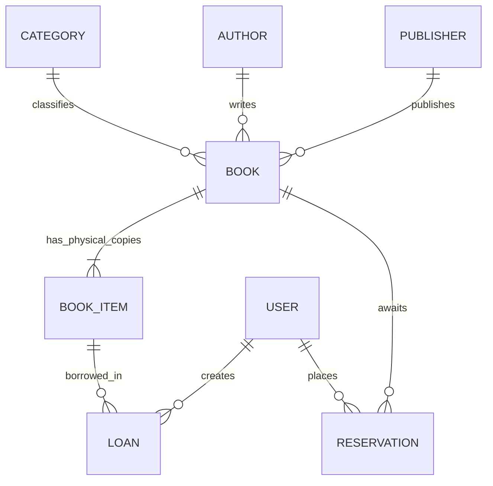

# 📚 Hệ Thống Quản Lý Thư Viện Thông Minh (Smart Library Management System)

<div align="center">


**Giải pháp chuyển đổi số toàn diện cho công tác quản lý tài nguyên học liệu và lưu thông sách học đường.**

[Mục tiêu](#1--mục-tiêu-dự-án) • [Kiến trúc & Công nghệ](#2-️-kiến-trúc--công-nghệ-tech-stack) • [Chức năng cốt lõi](#3--danh-sách-chức-năng-cốt-lõi-crud) • [Điểm nhấn nâng cao](#4--các-chức-năng-nâng-cao-điểm-nhấn-đồ-án) • [Hướng dẫn cài đặt](#5--hướng-dẫn-cài-đặt--khởi-chạy) • [Tài khoản Demo](#6--tài-khoản-thử-nghiệm)

</div>

---

## 1. 🎯 Mục tiêu dự án

Dự án **Hệ thống Quản lý Thư viện Thông minh** được phát triển nhằm hiện đại hóa và số hóa triệt để quy trình quản lý học liệu cùng nghiệp vụ mượn/trả sách truyền thống tại các thư viện đại học và trường học:

* 📖 **Chuẩn hóa mô hình sách**: Tách biệt rõ ràng giữa **Đầu sách (Book Title)** và **Bản sao vật lý (BookItem)**, giúp định danh chính xác từng cuốn sách cụ thể bằng mã vạch (Barcode) riêng biệt và vị trí trên kệ.
* ⚡ **Tự động hóa nghiệp vụ thủ thư**: Giảm tải thao tác thủ công thông qua tính năng quét mã vạch mượn/trả tức thì, nhập sách hàng loạt bằng file Excel và hệ thống hàng đợi đặt trước (Reservation).
* 🛡️ **Kiểm soát và hạn chế rủi ro**: Ngăn chặn thất thoát tài sản thư viện bằng cơ chế chặn độc giả vi phạm (Blacklist), kiểm tra nợ sách quá hạn và siết hạn mức mượn theo hạng thẻ thành viên.
* ⏰ **Hệ thống thông báo chủ động**: Định kỳ chạy ngầm (Cron Job) rà soát hạn mượn và tự động gửi email thông báo nhắc nhở đến từng sinh viên/độc giả mỗi ngày.
* 📊 **Trực quan hóa dữ liệu quản trị**: Cung cấp Dashboard theo dõi lưu lượng mượn trả theo thời gian thực, biểu đồ xu hướng hàng tháng và hỗ trợ xuất báo cáo PDF chuẩn hóa.

---

## 2. 🏗️ Kiến trúc & Công nghệ (Tech Stack)

Hệ thống được xây dựng theo kiến trúc phân tầng **Client - Server (RESTful API)** hiện đại:

```
┌────────────────────────────────────────────────────────────────────────┐
│                   GIAO DIỆN CLIENT (SPA - React 18 + Vite)             │
│   • Tailwind CSS 4, Radix UI Primitives, Lucide Icons, Recharts        │
│   • TanStack Query (React Query v5) - Server State Caching             │
│   • html2canvas + jsPDF - Kết xuất báo cáo PDF phía Client             │
└───────────────────────────────────┬────────────────────────────────────┘
                                    │ HTTP / REST API (Axios + JWT Auth)
                                    ▼
┌────────────────────────────────────────────────────────────────────────┐
│               MÁY CHỦ BACKEND (Node.js + Express 5 + TypeScript)       │
│   • Controllers & Routes phân tầng chuyên biệt                         │
│   • Middlewares: JWT Authentication, Risk Evaluation Engine            │
│   • Background Services: node-cron (Scheduler), Nodemailer (Email Engine)
│   • Data Ingestion: Multer (Memory Storage) + xlsx (SheetJS)           │
└───────────────────────────────────┬────────────────────────────────────┘
                                    │ Prisma ORM 5.22
                                    ▼
┌────────────────────────────────────────────────────────────────────────┐
│                   CƠ SỞ DỮ LIỆU QUAN HỆ (SQLite / dev.db)              │
│   • User, Token, Book, BookItem, Category, Author, Publisher,          │
│     Loan, Reservation, AuditLog                                        │
└────────────────────────────────────────────────────────────────────────┘
```

### 2.1. Phía Frontend
* **Core & Build Tool**: `React 18.3`, `Vite 6`, `TypeScript 5.9`.
* **State & Server Cache**: `@tanstack/react-query` v5 tối ưu hóa truy vấn, tự động đồng bộ hóa và vô hiệu hóa cache (cache invalidation) ngay khi dữ liệu thay đổi.
* **Giao diện & Trải nghiệm (UI/UX)**:
  - `Tailwind CSS 4`: Bộ công cụ tiện ích CSS thế hệ mới, tối ưu hóa kích thước build.
  - `@radix-ui/*`: Bộ UI components headless đạt chuẩn Accessibility (a11y).
  - `Lucide React`: Thư viện icon phong phú, tối giản.
  - `Recharts`: Trực quan hóa dữ liệu lưu thông sách qua biểu đồ cột trực quan.
  - Hỗ trợ đầy đủ chế độ nền tối/sáng (**Dark Mode**) và đa ngôn ngữ (**Song ngữ Anh - Việt**).
* **Xuất bản tài liệu**: `html2canvas` kết hợp `jspdf` giúp chụp vùng hiển thị báo cáo và tải về file PDF chất lượng cao.

### 2.2. Phía Backend
* **Runtime & Framework**: `Node.js 20.x` với `Express 5.2` viết 100% bằng `TypeScript`.
* **ORM & Database**: `Prisma ORM 5.22` kết nối cơ sở dữ liệu quan hệ SQLite (linh hoạt chuyển đổi sang PostgreSQL/MySQL trong môi trường triển khai thực tế).
* **Bảo mật**: `jsonwebtoken` (JWT) bảo vệ các endpoint API riêng tư, `bcryptjs` mã hóa băm mật khẩu 10 rounds an toàn.

### 2.3. Bảng tổng hợp các thư viện chuyên trách

| Thư viện | Danh mục | Vai trò kỹ thuật trong hệ thống |
| :--- | :--- | :--- |
| **`xlsx` (SheetJS)** | File Processing | Phân tích binary buffer từ file Excel (.xlsx, .xls) để nạp danh mục sách hàng loạt vào database. |
| **`multer`** | Middleware | Tiếp nhận payload multipart/form-data trong RAM thông qua `memoryStorage`, loại bỏ việc tạo file tạm rác trên ổ cứng. |
| **`node-cron`** | Job Scheduling | Lập lịch tiến trình chạy ngầm (chạy vào 08:00 sáng mỗi ngày) tự động quét và phân loại phiếu mượn. |
| **`nodemailer`** | Mail Service | Gửi email HTML thông báo nhắc nhở tự động, tích hợp tài khoản test Ethereal Email và sẵn sàng hỗ trợ Gmail SMTP. |
| **`jspdf` & `html2canvas`** | Document Export | Trích xuất và định dạng báo cáo thống kê thư viện ra khổ giấy A4 Landscape trực tiếp trên trình duyệt. |

---

## 3. 📋 Danh sách Chức năng cốt lõi (CRUD)

Mô hình dữ liệu được thiết kế bám sát thực tế lưu thông của các thư viện hiện đại:



### 3.1. 📖 Quản lý Đầu sách (Book Title Management)
* **Thông tin lưu trữ đầy đủ**: Tên sách, mã chuẩn quốc tế ISBN (Unique), Thể loại, Tác giả, Nhà xuất bản, Năm phát hành, Số trang, Ngôn ngữ, Tóm tắt và Ảnh bìa.
* **Chuẩn hóa dữ liệu**: Tác giả (`Author`), Thể loại (`Category`) và Nhà xuất bản (`Publisher`) được lưu trữ ở các bảng độc lập và tự động chuẩn hóa bằng cơ chế `upsert`, loại bỏ hoàn toàn việc trùng lặp tên danh mục.
* **Modal thông tin chi tiết**: Xem đầy đủ các bản sao vật lý hiện có, vị trí giá sách và tình trạng khả dụng.

### 3.2. 🏷️ Quản lý Bản sao vật lý (`BookItem`)
* **Mỗi cuốn sách thực tế là một thực thể độc lập**: Một đầu sách có thể có $N$ bản sao vật lý. Mỗi bản sao được dán một nhãn mã vạch duy nhất (Barcode dạng `BC-{ISBN}-{001}`) kèm vị trí lưu trữ (VD: `Khu A - Kệ 1`).
* **Trạng thái vòng đời**:
  - `AVAILABLE`: Sẵn sàng phục vụ độc giả mượn tại chỗ hoặc mang về.
  - `BORROWED`: Đang được độc giả lưu giữ theo một phiếu mượn hợp lệ.
  - `LOST` / `DAMAGED`: Đã báo mất hoặc hư hỏng cần thanh lý.
* **Ràng buộc an toàn dữ liệu**: Hệ thống kiên quyết không cho phép xóa đầu sách nếu vẫn còn bản sao vật lý đang được độc giả mượn (`status = BORROWED`).

### 3.3. 👤 Quản lý Thẻ độc giả (Member Management)
* **Quản trị hồ sơ**: Lưu trữ Họ tên, Email, Mật khẩu băm an toàn, Ngày tham gia, Hạng thành viên và Trạng thái thẻ.
* **Phân quyền người dùng (Role-Based Access Control)**:
  - `ADMIN`: Toàn quyền quản trị danh mục sách, phê duyệt mượn/trả, phân hạng thành viên, thiết lập Blacklist và quản lý tác vụ ngầm.
  - `USER`: Độc giả tra cứu sách, gửi yêu cầu đặt trước (Reservation) khi hết sách và theo dõi lịch sử mượn trả cá nhân.

### 3.4. 🔄 Quản lý Lưu thông Mượn / Trả (Loan Circulation)
* **Phiếu mượn định danh chính xác**: Tạo phiếu mượn gắn trực tiếp với `bookItemId` cụ thể, tự động ấn định hạn trả (14 ngày).
* **Theo dõi trạng thái thời gian thực**:
  - 🟢 `On Time`: Phiếu mượn đang trong thời hạn an toàn.
  - 🟡 `Due Soon`: Sắp đến hạn trả (còn dưới 2 ngày).
  - 🔴 `Overdue`: Đã quá hạn hoàn trả, tự động tính toán số ngày trễ và phát sinh phí phạt.
  - ⚪ `Returned`: Hoàn trả thành công, hoàn nguyên trạng thái bản sao vật lý về `AVAILABLE`.

---

## 4. ⚡ Các Chức năng nâng cao (Điểm nhấn đồ án)

| Chức năng nâng cao | Giá trị thực tiễn & Điểm nhấn kỹ thuật |
| :--- | :--- |
| **📥 Nhập sách hàng loạt (Excel)** | Tiếp nhận file Excel, phân tích linh hoạt tiêu đề tiếng Việt/Anh, tự động upsert tác giả/thể loại và sinh mã vạch vật lý cho từng cuốn. |
| **📱 Quét mã vạch Barcode POS** | Tương thích máy quét mã vạch cầm tay, cho phép tra cứu thông tin sách, tạo phiếu mượn và thu hồi sách trả chỉ trong 1 giây. |
| **📊 Xuất báo cáo PDF** | Chụp vùng hiển thị đồ thị và số liệu KPI từ Dashboard, kết xuất file PDF chuẩn A4 chuyên nghiệp dùng nộp báo cáo định kỳ. |
| **🔖 Đặt trước sách (Reservation)** | Xếp hàng chờ tự động khi đầu sách hết bản sao trống, tự động gửi thông báo ưu tiên nhận sách khi có người trả. |
| **🛡️ Kiểm duyệt rủi ro 3 lớp** | Chặn mượn sách nếu tài khoản nằm trong **Danh sách Đen (Blacklist)**, đang có nợ sách quá hạn, hoặc vượt quá **Hạn mức mượn** theo hạng thẻ. |
| **⏰ Tự động nhắc hạn (Cronjob)** | Tiến trình chạy ngầm lúc 08:00 sáng mỗi ngày, quét tìm sách sắp đến hạn và quá hạn để gửi email thông báo HTML bắt mắt. |

---

### 4.1. 📥 Nhập danh mục sách từ file Excel (Bulk Import Excel)
* **Cơ chế**: File tải lên được đưa thẳng vào RAM qua `multer.memoryStorage()`. Module `xlsx` duyệt từng dòng và chuẩn hóa tên cột (nhận diện cả `Tiêu đề`, `Tên sách`, `title`, `Số lượng`, `copies`...).
* **Xử lý toàn vẹn**: Tự động sinh $N$ bản ghi `BookItem` cho $N$ cuốn sách thực tế kèm mã vạch độc nhất `BC-{ISBN}-{Index}`.
* **Nhật ký hệ thống**: Mọi đợt import đều được tự động lưu vết vào bảng `AuditLog` phục vụ tra cứu lịch sử quản trị.

### 4.2. 📱 Quét mã vạch khi Mượn & Trả (Barcode Scanner Workflow)
* **Tra cứu tức thì**: Nhập hoặc "bắn" tia quét mã vạch, hệ thống gọi API `GET /api/loans/barcode/:barcode` trả về ngay ảnh bìa, vị trí lưu trữ tại kệ và trạng thái hiện tại.
* **Cho mượn siêu tốc**: Chọn độc giả và quét mã vạch $\rightarrow$ Hệ thống tự động kiểm tra điều kiện an toàn và lập phiếu mượn thành công.
* **Thu hồi trong 1 thao tác**: Độc giả mang sách trả $\rightarrow$ Quét mã vạch trên gáy sách $\rightarrow$ Hệ thống tự tìm phiếu mượn tương ứng, tính phí phạt (nếu có) và đóng phiếu ngay lập tức.

### 4.3. 📊 Xuất báo cáo thống kê PDF chuyên nghiệp
* Sử dụng bộ đôi thư viện `html2canvas` (chụp khối Dashboard ở tỷ lệ `scale: 2` sắc nét) và `jsPDF` đóng gói báo cáo ở khổ giấy A4 Landscape.
* Tự động bổ sung tiêu đề cơ quan, ngày xuất báo cáo và biểu đồ xu hướng mượn sách theo từng tháng.

### 4.4. 🔖 Hàng đợi Đặt trước sách (Book Reservation Queue)
* Khi toàn bộ bản sao của một đầu sách đều đang được mượn (`available = 0`), nút **Đặt trước (Reserve)** sẽ mở cho độc giả đăng ký.
* Hệ thống xếp độc giả vào hàng đợi theo cơ chế FIFO (`WAITING`) và thông báo số thứ tự trong hàng chờ.
* Khi có độc giả trả sách, thủ thư cập nhật trạng thái sang `NOTIFIED` (Đã có sách, đang chờ lấy) trước khi chuyển thành `FULFILLED` khi giao sách thành công.

### 4.5. 🛡️ Kiểm duyệt rủi ro mượn sách (Risk Assessment Engine)
Hàm kiểm soát rủi ro `validateBorrowRisk` được thực thi trước mỗi giao dịch mượn sách:
1. **Kiểm tra Blacklist**: Từ chối ngay nếu tài khoản độc giả đang có cờ `isBlacklisted = true`.
2. **Kiểm tra nợ sách quá hạn**: Chặn mượn sách mới nếu độc giả đang giữ bất kỳ cuốn sách nào đã quá hạn trả (`dueDate < now`).
3. **Giới hạn số lượng sách mượn đồng thời theo hạng thành viên**:
   - `STANDARD` (Sinh viên thường): Tối đa **5 cuốn**.
   - `PREMIUM` (Sinh viên xuất sắc/Cao học): Tối đa **10 cuốn**.
   - `LECTURER` (Giảng viên/Nghiên cứu viên): Tối đa **15 cuốn**.

### 4.6. ⏰ Tác vụ chạy ngầm gửi Email tự động (Cron Job & Nodemailer)
* **Lập lịch thông minh**: `node-cron` kích hoạt định kỳ vào lúc **08:00 sáng mỗi ngày** (`0 8 * * *`).
* **Phân loại nội dung email**:
  - ⏳ **Sắp đến hạn (còn 1-2 ngày)**: Gửi thư nhắc nhở màu xanh lịch sự kèm chi tiết tên sách, mã vạch và ngày hết hạn.
  - ⚠️ **Quá hạn**: Gửi thư cảnh báo màu đỏ khẩn cấp, thông báo số ngày trễ hạn, cảnh báo nguy cơ bị khóa quyền mượn sách và phát sinh tiền phạt.
* **Kích hoạt thủ công (On-Demand)**: Hỗ trợ nút bấm trên giao diện thủ thư để kích hoạt quét và gửi thư ngay lập tức mà không cần chờ tới 08:00 sáng.

---

## 5. 🚀 Hướng dẫn Cài đặt & Khởi chạy

### Yêu cầu tiên quyết
* Máy tính đã cài đặt **Node.js** (Phiên bản 18.x hoặc 20.x LTS trở lên) và **npm** / **pnpm**.

### Bước 1: Cài đặt Dependencies cho cả 2 phía

Mở Terminal tại thư mục gốc của dự án:

```bash
# Cài đặt thư viện cho Frontend (Root)
npm install

# Cài đặt thư viện cho Backend (Server)
cd server
npm install
cd ..
```

### Bước 2: Thiết lập file cấu hình môi trường (.env)

Kiểm tra hoặc tạo file `.env` bên trong thư mục `server/` với nội dung sau:

```env
PORT=5000
DATABASE_URL="file:./dev.db"
JWT_SECRET="super_secret_jwt_key_123456"

# (Tùy chọn) Cấu hình Gmail SMTP nếu muốn gửi thư thật:
# SMTP_HOST=smtp.gmail.com
# SMTP_PORT=587
# SMTP_USER=your_email@gmail.com
# SMTP_PASS=your_app_password
```
> **Ghi chú**: Nếu không cấu hình SMTP thật, hệ thống sẽ tự động chuyển sang tài khoản giả lập **Ethereal Mail** an toàn để thử nghiệm mà không gây lỗi.

### Bước 3: Đồng bộ Database và nạp dữ liệu mẫu (Seed Data)

Di chuyển vào thư mục `server` để chuẩn bị cơ sở dữ liệu:

```bash
cd server

# Đồng bộ mô hình cơ sở dữ liệu với Prisma
npx prisma db push

# Nạp dữ liệu sách và tài khoản demo ban đầu
npx ts-node src/seed.ts

cd ..
```

### Bước 4: Khởi động toàn bộ dự án

Chạy lệnh đồng thời cả Server Backend và Client Frontend chỉ với 1 câu lệnh duy nhất từ thư mục gốc:

```bash
npm run dev
```

* 🌐 **Giao diện người dùng (Frontend)**: `http://localhost:5173`
* 🔌 **Cổng dịch vụ API (Backend)**: `http://localhost:5000`

---

## 6. 👥 Tài khoản thử nghiệm

Hệ thống đã chuẩn bị sẵn 2 tài khoản mẫu trong tệp Seed Data để kiểm thử ngay lập tức:

| Vai trò (Role) | Email đăng nhập | Mật khẩu | Hạng thành viên | Quyền hạn nổi bật |
| :--- | :--- | :---: | :---: | :--- |
| **Thủ thư (Admin)** | `admin@library.com` | `123` | `PREMIUM` | Quản trị đầu sách, Import Excel, Quét mã vạch mượn/trả, Bật/tắt Blacklist, Duyệt đặt trước, Kích hoạt Cronjob Email. |
| **Độc giả (User)** | `user@library.com` | `123` | `STANDARD` | Tra cứu kho sách, Đặt trước khi hết sách (Reservation), Xem lịch sử mượn sách của bản thân. |

---

## 7. 📁 Cấu trúc thư mục dự án

```
Library Management System UI (Community)/
├── server/                           # Backend Application (Node.js/Express)
│   ├── prisma/
│   │   ├── dev.db                    # CSDL SQLite cục bộ
│   │   └── schema.prisma             # Định nghĩa mô hình dữ liệu (Prisma Schema)
│   ├── src/
│   │   ├── controllers/              # Bộ điều khiển xử lý nghiệp vụ API
│   │   ├── jobs/                     # Tác vụ định kỳ chạy ngầm (reminderJob)
│   │   ├── middleware/               # Middleware xác thực JWT, phân quyền
│   │   ├── routes/                   # Định tuyến các endpoints RESTful
│   │   ├── services/                 # Dịch vụ gửi thư điện tử (mailService)
│   │   ├── index.ts                  # Điểm khởi chạy Server
│   │   └── seed.ts                   # Dữ liệu khởi tạo ban đầu
│   ├── .env                          # Biến môi trường Backend
│   └── package.json                  # Cấu hình gói & kịch bản Backend
├── src/                              # Frontend Application (React 18 + Vite)
│   ├── app/
│   │   ├── api/                      # Axios Client cấu hình kết nối API
│   │   ├── components/               # Các trang và thành phần giao diện
│   │   │   ├── BooksManagement.tsx   # Quản lý đầu sách, Import Excel
│   │   │   ├── BorrowedBooks.tsx     # Quản lý mượn/trả, Quét mã vạch, Đặt trước
│   │   │   ├── Dashboard.tsx         # Bảng thống kê, Biểu đồ & Xuất PDF
│   │   │   ├── MembersManagement.tsx # Quản lý độc giả & Danh sách đen (Blacklist)
│   │   │   └── UserProfile.tsx       # Trang cá nhân của độc giả
│   │   ├── contexts/                 # Context quản lý Auth, Theme, Ngôn ngữ
│   │   ├── App.tsx                   # Cấu hình Route điều hướng
│   │   └── Layout.tsx                # Khung giao diện dùng chung
├── package.json                      # Cấu hình gói & kịch bản Root
├── vite.config.ts                    # Cấu hình Vite Build Tool
└── README.md                         # Tài liệu hướng dẫn & Tổng quan dự án
```

<div align="center">

**Đồ án Môn học - Hệ Thống Quản Lý Thư Viện Thông Minh**  
*Phát triển với sự tận tâm và chuẩn mực kỹ thuật cao nhất.*

</div>
