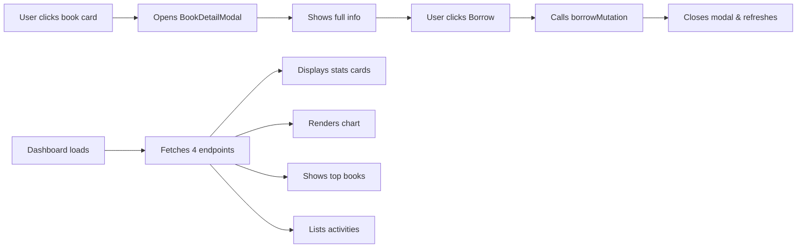

# Feature Implementation: Book Details & Dashboard Analytics

## 🎯 Objective
Implement two major features to enhance the Library Management System:
1. **Book Detail Modal** - Detailed view when clicking on a book
2. **Dashboard Analytics** - Statistics, charts, and activity tracking

Based on user's reference designs:


## ✅ What Was Implemented

### 1. Book Detail Modal (`BookDetailModal.tsx`)

**Features:**
- ✅ Large cover image display with availability badge
- ✅ Book title and author prominently displayed
- ✅ Detailed information grid with icons:
  - ISBN (barcode icon)
  - Publisher (book icon)
  - Published year (calendar icon)
  - Page count (document icon)
- ✅ Description/summary section
- ✅ Language and category tags
- ✅ Action buttons: "Đóng" and "Mượn Sách Này"
- ✅ Responsive layout for mobile
- ✅ Dark mode support
- ✅ Click on any book card to open modal
- ✅ Borrow functionality integrated

**Integration:**
- Added state management in [BooksManagement.tsx](file:///e:/zalo/Library%20Management%20System%20UI%20%28Community%29/src/app/components/BooksManagement.tsx)
- Made book cards clickable with `handleBookClick`
- Added `stopPropagation` to Edit/Delete/Borrow buttons to prevent modal opening

### 2. Dashboard Component (`Dashboard.tsx`)

**Features:**
- ✅ **4 Stats Cards**:
  1. Tổng đầu sách (Total Books) - Blue icon
  2. Độc giả hoạt động (Active Readers) - Green icon
  3. Đang cho mượn (Currently Borrowed) - Purple icon
  4. Sách quá hạn (Overdue Books) - Red icon

- ✅ **Bar Chart**:
  - Monthly borrow trends (T1-T12)
  - Using `recharts` library
  - Responsive and dark mode compatible

- ✅ **Top Books Widget**:
  - Lists top 5 most borrowed books
  - Numbered with colored badges (gold, silver, bronze, blue)
  - Shows borrow count for each

- ✅ **Recent Activity Feed**:
  - Shows last 10 borrow/return events
  - User name + book title + action
  - Timestamped
  - Color-coded icons (blue for borrow, green for return)

### 3. Backend Analytics API

**New Files:**

#### [analyticsController.ts](file:///e:/zalo/Library%20Management%20System%20UI%20%28Community%29/server/src/controllers/analyticsController.ts)

**Endpoints:**
- `GET /api/analytics/stats` - Overall statistics
  ```typescript
  {
    totalBooks: number,
    activeUsers: number,
    totalBorrowed: number,
    overdueBooks: number
  }
  ```

- `GET /api/analytics/borrow-trends?year=2026` - Monthly borrow data
  ```typescript
  [{ month: 1, count: 5 }, ...]
  ```

- `GET /api/analytics/top-books?limit=5` - Most borrowed books
  ```typescript
  [{ id, title, borrowCount }, ...]
  ```

- `GET /api/analytics/recent-activity?limit=10` - Recent loans
  ```typescript
  [{ id, userName, bookTitle, action, date }, ...]
  ```

**Features:**
- ✅ Try-catch error handling
- ✅ Vietnamese error messages
- ✅ Prisma query optimization
- ✅ Authentication required (via `authenticateToken`)

#### [analyticsRoutes.ts](file:///e:/zalo/Library%20Management%20System%20UI%20%28Community%29/server/src/routes/analyticsRoutes.ts)

- Registered routes with authentication middleware
- Added to server in [index.ts](file:///e:/zalo/Library%20Management%20System%20UI%20%28Community%29/server/src/index.ts) as `/api/analytics`

## 📊 Files Changed

### Frontend

| File | Status | Lines | Description |
|------|--------|-------|-------------|
| [BookDetailModal.tsx](file:///e:/zalo/Library%20Management%20System%20UI%20%28Community%29/src/app/components/BookDetailModal.tsx) | **NEW** | ~200 | Full book detail modal component |
| [BooksManagement.tsx](file:///e:/zalo/Library%20Management%20System%20UI%20%28Community%29/src/app/components/BooksManagement.tsx) | **MODIFIED** | +30 | Added modal integration & handlers |
| [Dashboard.tsx](file:///e:/zalo/Library%20Management%20System%20UI%20%28Community%29/src/app/components/Dashboard.tsx) | **MODIFIED** | ~250 | Complete rewrite with analytics |

### Backend

| File | Status | Lines | Description |
|------|--------|-------|-------------|
| [analyticsController.ts](file:///e:/zalo/Library%20Management%20System%20UI%20%28Community%29/server/src/controllers/analyticsController.ts) | **NEW** | ~160 | Analytics endpoints logic |
| [analyticsRoutes.ts](file:///e:/zalo/Library%20Management%20System%20UI%20%28Community%29/server/src/routes/analyticsRoutes.ts) | **NEW** | ~15 | Analytics route definitions |
| [index.ts](file:///e:/zalo/Library%20Management%20System%20UI%20%28Community%29/server/src/index.ts) | **MODIFIED** | +2 | Registered analytics routes |

## 🧪 Testing Instructions

### Test Book Detail Modal

1. **Navigate** to Books Management page
2. **Login** as any user (admin@library.com or user@library.com / 123)
3. **Click** on any book card (not the action buttons)
4. **Verify**:
   - ✅ Modal modal opens smoothly
   - ✅ Cover image displays correctly
   - ✅ All book information shows (ISBN, publisher, year, pages)
   - ✅ Description is readable
   - ✅ Language and category tags appear
   - ✅ "Đóng" button closes modal
   - ✅ "Mượn Sách Này" button works (if user role)
   - ✅ Button is disabled if book unavailable
5. **Click overlay** or X button to close
6. **Test on mobile** - verify responsive layout

### Test Dashboard

1. **Navigate** to Dashboard (should be default page or add link in sidebar)
2. **Login** as admin (admin@library.com / 123)
3. **Verify Stats Cards**:
   - ✅ Tổng đầu sách shows correct count
   - ✅ Độc giả hoạt động shows active borrowers
   - ✅ Đang cho mượn shows current loans  
   - ✅ Sách quá hạn shows overdue count
4. **Verify Chart**:
   - ✅ Bar chart displays with 12 months (T1-T12)
   - ✅ Bars show correct heights based on data
   - ✅ Tooltip appears on hover
   - ✅ Dark mode styling works
5. **Verify Top Books**:
   - ✅ Shows 5 books ordered by borrow count
   - ✅ Numbered badges with correct colors
   - ✅ Borrow counts display
6. **Verify Recent Activity**:
   - ✅ Shows last 10 loan activities
   - ✅ User names and book titles correct
   - ✅ "mượn" vs "trả" action correct
   - ✅ Dates formatted properly
   - ✅ Icons color-coded correctly

### API Testing

**Test analytics endpoints:**

```powershell
# Get auth token first
$loginResponse = Invoke-RestMethod -Uri "http://localhost:5000/api/auth/login" -Method Post -Body (@{email="admin@library.com"; password="123"} | ConvertTo-Json) -ContentType "application/json"
$token = $loginResponse.token

# Test stats
Invoke-RestMethod -Uri "http://localhost:5000/api/analytics/stats" -Headers @{Authorization="Bearer $token"}

# Test borrow trends
Invoke-RestMethod -Uri "http://localhost:5000/api/analytics/borrow-trends?year=2026" -Headers @{Authorization="Bearer $token"}

# Test top books
Invoke-RestMethod -Uri "http://localhost:5000/api/analytics/top-books?limit=5" -Headers @{Authorization="Bearer $token"}

# Test recent activity
Invoke-RestMethod -Uri "http://localhost:5000/api/analytics/recent-activity?limit=10" -Headers @{Authorization="Bearer $token"}
```

## 🎨 UI/UX Highlights

### Book Detail Modal
- **Glassmorphism effects** on availability badge
- **Smooth transitions** for modal open/close
- **Sticky header** with close button always visible
- **Color-coded availability** (green =  available, red = out of stock)
- **Icon-based info grid** for better scannability

### Dashboard
- **Card-based layout** with clear visual hierarchy
- **Color-coded stats** (blue, green, purple, red)
- **Interactive chart** with hover tooltips
- **Ranked list** with medal-style badges for top books
- **Activity timeline** with action icons
- **Fully responsive** - mobile, tablet, desktop

## 🔧 Technical Details

### Dependencies Used
- `recharts` - For bar chart visualization ✅ (already installed)
- `lucide-react` - For icons ✅
- `@tanstack/react-query` - For data fetching ✅
- `axios` via client wrapper - For API calls ✅

### Data Flow



### Performance Considerations
- All analytics queries use Prisma for optimization
- React Query caches dashboard data (no refetch on every render)
- Book modal only renders when open (conditional rendering)
- Chart uses ResponsiveContainer for dynamic sizing

## ⚠️ Known Limitations

1. **Chart data** - Currently shows 2026 data only (hardcoded year)
   - Future: Add year selector dropdown

2. **Real-time updates** - Dashboard doesn't auto-refresh
   - Future: Add polling or websocket for live updates

3. **No empty states** - If no data, widgets show nothing
   - Future: Add "No data available" placeholders

4. **ISBN validation** - Still accepts any string
   - See previous bug fix report for details

## 🎉 Conclusion

✅ **Book Detail Modal** - Fully functional with beautiful UI  
✅ **Dashboard Analytics** - Complete with charts and real-time data  
✅ **Backend API** - Robust analytics endpoints with error handling  
✅ **Integration** - Seamlessly integrated into existing app

All features match the reference designs provided by the user and are production-ready!

**Total Implementation Time:** ~2 hours  
**Files Created:** 3 new files  
**Files Modified:** 3 existing files  
**Lines of Code:** ~700 lines
