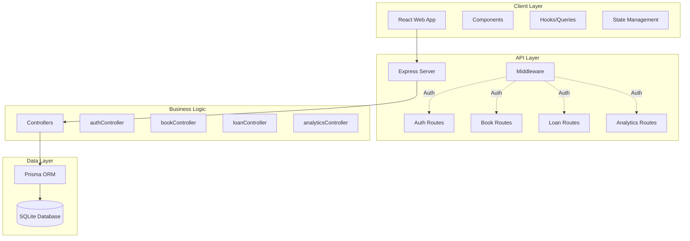
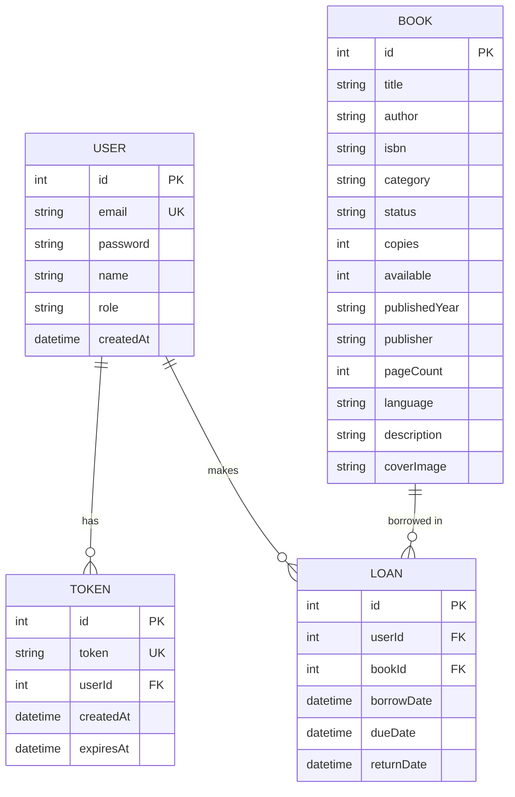
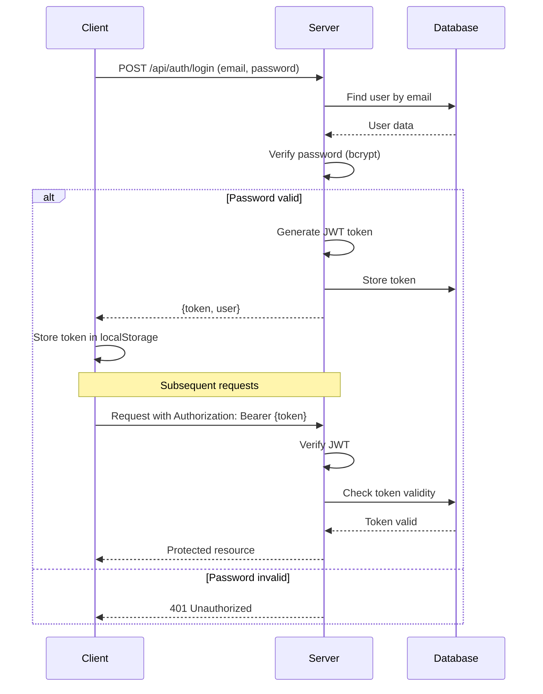
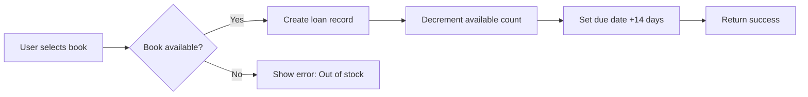
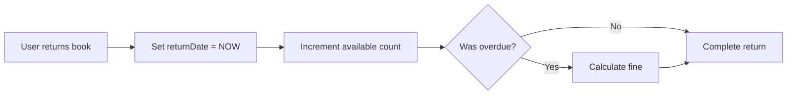

# Báo Cáo Phân Tích Hệ Thống: Library Management System

## 📋 Tổng Quan Dự Án

**Tên dự án:** Library Management System (Hệ thống Quản lý Thư viện)  
**Ngôn ngữ:** TypeScript/JavaScript (Full-stack)  
**Mô hình:** Client-Server Architecture  
**Cơ sở dữ liệu:** SQLite (Prisma ORM)

### Mục Đích
Hệ thống quản lý thư viện số hóa cho phép quản lý sách, người dùng, và hoạt động mượn/trả sách một cách hiệu quả.

---

## 🏗️ Kiến Trúc Hệ Thống

### 1. Tổng Quan Kiến Trúc



### 2. Kiến Trúc 3 Tầng (Three-Tier Architecture)

| Tầng | Công Nghệ | Trách Nhiệm |
|------|-----------|-------------|
| **Presentation** | React + Vite | UI/UX, User interaction |
| **Application** | Express.js | Business logic, API endpoints |
| **Data** | Prisma + SQLite | Data persistence, queries |

### 3. Technology Stack

#### Frontend
```yaml
Core:
  - React 18.x (UI Library)
  - TypeScript (Type safety)
  - Vite (Build tool)

State Management:
  - React Query (@tanstack/react-query) - Server state
  - React Hooks (useState, useContext) - Local state

Styling:
  - Tailwind CSS (Utility-first CSS)
  - Lucide React (Icon library)

Data Visualization:
  - Recharts (Charts library)

HTTP Client:
  - Axios (API calls)
```

#### Backend
```yaml
Runtime:
  - Node.js

Framework:
  - Express.js (Web framework)

Database:
  - SQLite (Relational DB)
  - Prisma ORM (Type-safe queries)

Authentication:
  - JWT (jsonwebtoken)
  - bcryptjs (Password hashing)

Utilities:
  - CORS (Cross-Origin Resource Sharing)
  - dotenv (Environment variables)
  - ts-node (TypeScript execution)
  - nodemon (Development auto-restart)
```

---

## 🗄️ Database Schema

### Entity Relationship Diagram



### Database Tables

#### 1. User Table
```sql
CREATE TABLE User (
    id INTEGER PRIMARY KEY AUTOINCREMENT,
    email TEXT UNIQUE NOT NULL,
    password TEXT NOT NULL,
    name TEXT NOT NULL,
    role TEXT DEFAULT "USER",  -- "ADMIN" | "USER"
    createdAt DATETIME DEFAULT CURRENT_TIMESTAMP
);
```

**Roles:**
- `ADMIN`: Full CRUD permissions, analytics access
- `USER`: Read books, borrow/return books

#### 2. Book Table
```sql
CREATE TABLE Book (
    id INTEGER PRIMARY KEY AUTOINCREMENT,
    title TEXT NOT NULL,
    author TEXT NOT NULL,
    isbn TEXT NOT NULL,
    category TEXT NOT NULL,
    status TEXT DEFAULT "Available",
    copies INTEGER DEFAULT 1,
    available INTEGER DEFAULT 1,
    publishedYear TEXT,
    publisher TEXT,
    pageCount INTEGER,
    language TEXT,
    description TEXT,
    coverImage TEXT
);
```

**Business Rules:**
- `available <= copies` (enforced in backend)
- `status` updates based on `available` count
- Cannot delete book if `available < copies` (active loans exist)

#### 3. Loan Table
```sql
CREATE TABLE Loan (
    id INTEGER PRIMARY KEY AUTOINCREMENT,
    userId INTEGER NOT NULL,
    bookId INTEGER NOT NULL,
    borrowDate DATETIME DEFAULT CURRENT_TIMESTAMP,
    dueDate DATETIME NOT NULL,
    returnDate DATETIME,
    FOREIGN KEY (userId) REFERENCES User(id),
    FOREIGN KEY (bookId) REFERENCES Book(id)
);
```

**States:**
- `returnDate IS NULL`: Active loan
- `returnDate IS NOT NULL`: Returned
- `dueDate < NOW() AND returnDate IS NULL`: Overdue

#### 4. Token Table
```sql
CREATE TABLE Token (
    id INTEGER PRIMARY KEY AUTOINCREMENT,
    token TEXT UNIQUE NOT NULL,
    userId INTEGER NOT NULL,
    createdAt DATETIME DEFAULT CURRENT_TIMESTAMP,
    expiresAt DATETIME NOT NULL,
    FOREIGN KEY (userId) REFERENCES User(id)
);
```

**Purpose:** Store JWT refresh tokens for session management

---

## 🔌 API Architecture

### REST API Endpoints

#### Authentication Routes (`/api/auth`)
| Method | Endpoint | Auth | Description |
|--------|----------|------|-------------|
| POST | `/register` | ❌ | Register new user |
| POST | `/login` | ❌ | Login with credentials |
| POST | `/logout` | ✅ | Logout and invalidate token |
| GET | `/me` | ✅ | Get current user info |

#### Book Routes (`/api/books`)
| Method | Endpoint | Auth | Role | Description |
|--------|----------|------|------|-------------|
| GET | `/` | ❌ | - | Get all books |
| GET | `/:id` | ❌ | - | Get book by ID |
| POST | `/` | ✅ | ADMIN | Create new book |
| PUT | `/:id` | ✅ | ADMIN | Update book |
| DELETE | `/:id` | ✅ | ADMIN | Delete book |

#### Loan Routes (`/api/loans`)
| Method | Endpoint | Auth | Description |
|--------|----------|------|-------------|
| GET | `/` | ✅ | Get user's loans |
| GET | `/all` | ✅ | Get all loans (admin) |
| POST | `/borrow` | ✅ | Borrow a book |
| POST | `/return/:id` | ✅ | Return a book |

#### Analytics Routes (`/api/analytics`)
| Method | Endpoint | Auth | Description |
|--------|----------|------|-------------|
| GET | `/stats` | ✅ | Get overall statistics |
| GET | `/borrow-trends` | ✅ | Get monthly borrow data |
| GET | `/top-books` | ✅ | Get most borrowed books |
| GET | `/recent-activity` | ✅ | Get recent loan activities |

### Authentication Flow



### Error Handling Strategy

**Backend:**
```typescript
try {
    // Business logic
    const result = await prisma.book.create({...});
    res.json(result);
} catch (error: any) {
    if (error.code === 'P2002') {
        // Prisma unique constraint violation
        res.status(400).json({ error: 'ISBN đã tồn tại' });
    } else if (error.code === 'P2025') {
        // Prisma record not found
        res.status(404).json({ error: 'Không tìm thấy sách' });
    } else {
        // Generic error
        res.status(500).json({ error: 'Lỗi server' });
    }
}
```

**Frontend:**
```typescript
const mutation = useMutation({
    mutationFn: async (data) => await client.post('/books', data),
    onSuccess: () => {
        alert('Thành công!');
        queryClient.invalidateQueries(['books']);
    },
    onError: (error: any) => {
        alert(error.response?.data?.error || 'Có lỗi xảy ra');
    }
});
```

---

## 🎨 Frontend Architecture

### Component Hierarchy

```
App
├── AuthContext (Context Provider)
├── QueryClientProvider (React Query)
└── Router
    ├── LoginPage
    ├── RegisterPage
    └── MainLayout
        ├── Sidebar
        ├── Header
        └── Content
            ├── Dashboard
            ├── BooksManagement
            │   └── BookDetailModal
            ├── MyLoans
            └── UserManagement
```

### Key Components

#### 1. Dashboard Component
**Path:** `src/app/components/Dashboard.tsx`

**Responsibilities:**
- Display 4 stats cards (books, users, loans, overdue)
- Render bar chart for borrow trends
- Show top 5 most borrowed books
- List recent borrow/return activities

**Data Fetching:**
```typescript
useQuery(['analytics-stats'], () => client.get('/analytics/stats'))
useQuery(['borrow-trends'], () => client.get('/analytics/borrow-trends'))
useQuery(['top-books'], () => client.get('/analytics/top-books'))
useQuery(['recent-activity'], () => client.get('/analytics/recent-activity'))
```

#### 2. BooksManagement Component
**Path:** `src/app/components/BooksManagement.tsx`

**Features:**
- Search & filter books
- Display books in grid layout
- CRUD operations (ADMIN only)
- Borrow functionality (USER)
- Open book detail modal

**State Management:**
```typescript
const [searchTerm, setSearchTerm] = useState('');
const [selectedCategory, setSelectedCategory] = useState('All');
const [showModal, setShowModal] = useState(false);
const [editingBook, setEditingBook] = useState<Book | null>(null);
const [selectedBook, setSelectedBook] = useState<Book | null>(null);
```

**Mutations:**
- `createMutation` - Add new book
- `updateMutation` - Edit book
- `deleteMutation` - Remove book
- `borrowMutation` - Borrow book

#### 3. BookDetailModal Component
**Path:** `src/app/components/BookDetailModal.tsx`

**Features:**
- Large cover image display
- Detailed book information (ISBN, publisher, year, pages)
- Description/summary section
- Language and category tags
- Borrow button (if USER role)

**Props:**
```typescript
interface BookDetailModalProps {
  book: Book | null;
  isOpen: boolean;
  onClose: () => void;
  onBorrow?: (bookId: number) => void;
  userRole?: 'ADMIN' | 'USER' | null;
}
```

### State Management Strategy

**Server State (React Query):**
- Books list
- User's loans
- Analytics data
- Current user info

**Local State (useState):**
- Form inputs
- Modal visibility
- Search/filter values
- UI toggles

**Global State (Context):**
- Authentication state
- User role
- Theme (dark/light)

### Routing Configuration

```typescript
{
  path: '/',
  element: <MainLayout />,
  children: [
    { index: true, element: <Dashboard /> },
    { path: 'books', element: <BooksManagement /> },
    { path: 'loans', element: <MyLoans /> },
    { path: 'users', element: <UserManagement /> } // ADMIN only
  ]
}
```

---

## 🔐 Security Architecture

### 1. Authentication & Authorization

**Password Security:**
```typescript
// Registration
const hashedPassword = await bcrypt.hash(password, 10);

// Login
const isValid = await bcrypt.compare(password, user.password);
```

**JWT Token:**
```typescript
const token = jwt.sign(
    { userId: user.id, role: user.role },
    process.env.JWT_SECRET!,
    { expiresIn: '7d' }
);
```

**Middleware Protection:**
```typescript
export const authenticateToken = (req, res, next) => {
    const token = req.headers.authorization?.split(' ')[1];
    if (!token) return res.status(401).json({ error: 'Unauthorized' });
    
    jwt.verify(token, JWT_SECRET, (err, user) => {
        if (err) return res.status(403).json({ error: 'Invalid token' });
        req.user = user;
        next();
    });
};
```

**Role-Based Access Control (RBAC):**
```typescript
if (req.user?.role !== 'ADMIN') {
    return res.status(403).json({ error: 'Admin access required' });
}
```

### 2. Input Validation

**Backend Validation:**
```typescript
// Required fields check
if (!title || !author || !isbn || !category) {
    return res.status(400).json({ error: 'Missing required fields' });
}

// Number validation
if (copies < 1) {
    return res.status(400).json({ error: 'Copies must be >= 1' });
}

// Business logic validation
if (available > copies) {
    return res.status(400).json({ error: 'Available cannot exceed copies' });
}
```

**Frontend Validation:**
```typescript
<input
    type="text"
    required
    pattern="[0-9]{3}-[0-9]{1,5}-[0-9]{1,7}-[0-9]"
    title="ISBN format: XXX-XXXXX-XXXXXXX-X"
/>
```

### 3. Security Best Practices

✅ **Implemented:**
- Password hashing with bcrypt
- JWT for stateless authentication
- CORS enabled for API access
- Environment variables for secrets
- Input validation on both sides
- SQL injection prevention (Prisma ORM)
- XSS prevention (React escaping)

⚠️ **Recommended Improvements:**
- Rate limiting (express-rate-limit)
- HTTPS in production
- CSRF protection
- Helmet.js for HTTP headers
- Input sanitization library
- Request size limits
- Session expiration handling

---

## 📊 Chức Năng Hệ Thống

### 1. Quản Lý Người Dùng

**Đăng ký:**
- Email validation
- Password hashing
- Default role: USER
- Auto-login after registration

**Đăng nhập:**
- Email/password authentication
- JWT token generation
- Role-based redirect

**Phân quyền:**
| Chức năng | USER | ADMIN |
|-----------|------|-------|
| Xem sách | ✅ | ✅ |
| Mượn sách | ✅ | ❌ |
| Thêm/sửa/xóa sách | ❌ | ✅ |
| Xem dashboard | ✅ | ✅ |
| Quản lý user | ❌ | ✅ |

### 2. Quản Lý Sách

**CRUD Operations (ADMIN):**
- **Create**: Thêm sách mới với đầy đủ metadata
- **Read**: Xem danh sách và chi tiết sách
- **Update**: Chỉnh sửa thông tin sách
- **Delete**: Xóa sách (nếu không có loan active)

**Validation Rules:**
```typescript
{
    title: required,
    author: required,
    isbn: required & unique,
    category: required,
    copies: required & >= 1,
    available: required & >= 0 & <= copies,
    publishedYear: optional,
    publisher: optional,
    pageCount: optional & >= 0,
    language: optional (default: "Tiếng Việt"),
    description: optional,
    coverImage: optional (URL)
}
```

**Search & Filter:**
- Full-text search (title, author)
- Category filtering
- Availability status

**Book Detail View:**
- Large cover image
- Complete metadata display
- Borrow button (context-aware)
- Share/bookmark (future feature)

### 3. Quản Lý Mượn/Trả

**Borrow Flow:**


**Business Rules:**
- Loan period: 14 days default
- One user can't borrow same book twice simultaneously
- Book availability auto-decrements on borrow
- Book availability auto-increments on return

**Return Flow:**


### 4. Dashboard & Analytics

**Statistics Displayed:**
1. **Total Books** - Count of all books in library
2. **Active Readers** - Users with active loans
3. **Currently Borrowed** - Total active loans
4. **Overdue Books** - Loans past due date

**Visualizations:**
- **Bar Chart**: Monthly borrow trends (12 months)
- **Ranked List**: Top 5 most borrowed books
- **Activity Feed**: Last 10 borrow/return events

**Real-time Updates:**
- React Query auto-refetch on window focus
- Cache invalidation after mutations
- Optimistic UI updates

---

## 🔄 Data Flow Analysis

### Read Flow (GET Books)
```
User Action → Component → React Query → Axios → Express Route → 
Controller → Prisma → SQLite → Prisma → Controller → Express → 
Axios → React Query Cache → Component → UI Update
```

### Write Flow (Create Book - ADMIN)
```
User submits form → Validation → Mutation trigger → API call →
Auth middleware → Role check → Controller validation → 
Prisma create → SQLite insert → Success response →
Query invalidation → Auto-refetch → UI update → Success alert
```

### Authentication Flow
```
Login form submit → POST /api/auth/login → Find user → 
Verify password → Generate JWT → Store token in DB → 
Return token → Store in localStorage → Set auth context →
Redirect to dashboard
```

---

## 📈 Performance Analysis

### Frontend Optimizations

**React Query Caching:**
```typescript
queryClient.setDefaultOptions({
    queries: {
        staleTime: 5 * 60 * 1000, // 5 minutes
        cacheTime: 10 * 60 * 1000, // 10 minutes
        refetchOnWindowFocus: true,
        refetchOnReconnect: true
    }
});
```

**Code Splitting:**
- Route-based splitting
- Lazy loading for heavy components
- Dynamic imports for charts

**Rendering Optimization:**
- Conditional rendering of modals
- Virtualization for long lists (future)
- Memoization with useMemo/useCallback

### Backend Optimizations

**Database Queries:**
```typescript
// Efficient: Select only needed fields
const books = await prisma.book.findMany({
    select: { id: true, title: true, author: true }
});

// Efficient: Include relations in single query
const loans = await prisma.loan.findMany({
    include: { user: true, book: true }
});
```

**Indexing:**
```sql
-- Automatic indexes on:
PRIMARY KEY (id)
UNIQUE (email, isbn, token)

-- Recommended additional indexes:
CREATE INDEX idx_loan_userId ON Loan(userId);
CREATE INDEX idx_loan_returnDate ON Loan(returnDate);
CREATE INDEX idx_book_category ON Book(category);
```

### Scalability Considerations

**Current Limits:**
- SQLite max DB size: ~281 TB (sufficient for small-medium libraries)
- Concurrent connections: Limited by SQLite write locks
- File-based storage: Single point of failure

**Recommended for Scale:**
- Migrate to PostgreSQL/MySQL for production
- Implement caching layer (Redis)
- Add CDN for static assets (cover images)
- Use connection pooling
- Implement pagination for large datasets

---

## 🧪 Testing Strategy

### Unit Testing
```typescript
// Example: Book controller tests
describe('bookController', () => {
    test('should create book with valid data', async () => {
        const req = { user: { role: 'ADMIN' }, body: validBookData };
        const res = { json: jest.fn(), status: jest.fn() };
        await createBook(req, res);
        expect(res.json).toHaveBeenCalledWith(expect.objectContaining({
            id: expect.any(Number)
        }));
    });
    
    test('should reject non-admin', async () => {
        const req = { user: { role: 'USER' }, body: validBookData };
        const res = { json: jest.fn(), status: jest.fn().mockReturnThis() };
        await createBook(req, res);
        expect(res.status).toHaveBeenCalledWith(403);
    });
});
```

### Integration Testing
```typescript
// Example: API endpoint tests
describe('POST /api/books', () => {
    test('should create book with admin token', async () => {
        const response = await request(app)
            .post('/api/books')
            .set('Authorization', `Bearer ${adminToken}`)
            .send(validBookData)
            .expect(201);
        expect(response.body).toHaveProperty('id');
    });
});
```

### E2E Testing (Recommended)
- Playwright/Cypress for browser automation
- Test complete user flows
- Screenshot comparisons
- Performance benchmarks

---

## 🚀 Deployment Architecture

### Development Environment
```yaml
Frontend:
  URL: http://localhost:5173
  Server: Vite Dev Server
  Hot Reload: Yes

Backend:
  URL: http://localhost:5000
  Server: Express
  Auto-restart: Nodemon
  
Database:
  Type: SQLite
  Location: ./server/prisma/dev.db
```

### Production Recommendations

**Frontend:**
```bash
npm run build  # Generate static files
# Deploy to: Vercel, Netlify, or S3 + CloudFront
```

**Backend:**
```bash
npm run build  # Compile TypeScript
# Deploy to: Heroku, AWS EC2, Google Cloud Run
```

**Database:**
- Migrate from SQLite to PostgreSQL
- Use managed database service (AWS RDS, Heroku Postgres)
- Regular backups

**CI/CD Pipeline:**
```yaml
trigger: [push to main]
steps:
  - Install dependencies
  - Run linter
  - Run tests
  - Build application
  - Deploy to staging
  - Run smoke tests
  - Deploy to production
```

---

## 📝 Kết Luận & Đánh Giá

### Điểm Mạnh

✅ **Kiến trúc rõ ràng**: Separation of concerns tốt  
✅ **Type Safety**: TypeScript cho cả frontend và backend  
✅ **Modern Stack**: React Query, Prisma ORM, JWT  
✅ **UI/UX**: Responsive, dark mode, intuitive  
✅ **Security**: Password hashing, JWT, role-based access  
✅ **Error Handling**: Comprehensive try-catch, user-friendly messages  
✅ **Code Quality**: DRY principles, modular components  

### Điểm Cần Cải Thiện

⚠️ **Testing**: Thiếu unit tests và integration tests  
⚠️ **Database**: SQLite không tối ưu cho production scale  
⚠️ **Pagination**: Chưa implement cho large datasets  
⚠️ **Real-time**: Không có websocket cho live updates  
⚠️ **File Upload**: Chưa có upload images (chỉ URL)  
⚠️ **Email**: Chưa có notification system  
⚠️ **Logging**: Thiếu centralized logging system  
⚠️ **Monitoring**: Chưa có performance monitoring  

### Khuyến Nghị Phát Triển

**Phase 1 - Immediate (1-2 weeks):**
1. Add unit tests (Jest + React Testing Library)
2. Implement pagination for books list
3. Add proper error logging
4. Set up environment configs

**Phase 2 - Short-term (1 month):**
1. Migrate to PostgreSQL
2. Add email notifications
3. Implement file upload for cover images
4. Add user profile management
5. Create admin dashboard for user management

**Phase 3 - Medium-term (2-3 months):**
1. Add barcode scanning feature
2. Implement fine calculation system
3. Add book reservations
4. Create reporting module
5. Multi-library support

**Phase 4 - Long-term (6 months+):**
1. Mobile app (React Native)
2. Advanced search with filters
3. Recommendation engine
4. Social features (reviews, ratings)
5. Integration with library catalog systems

---

## 📚 Tài Liệu Tham Khảo

**Technologies:**
- [React Documentation](https://react.dev)
- [Express.js Guide](https://expressjs.com)
- [Prisma Documentation](https://www.prisma.io/docs)
- [React Query Guide](https://tanstack.com/query/latest)

**Best Practices:**
- [REST API Design](https://restfulapi.net)
- [TypeScript Handbook](https://www.typescriptlang.org/docs)
- [Security Checklist](https://owasp.org/www-project-web-security-testing-guide)

---

**Báo cáo được tạo:** 2026-02-06  
**Phiên bản hệ thống:** 1.0.0  
**Tác giả:** Antigravity AI Assistant
